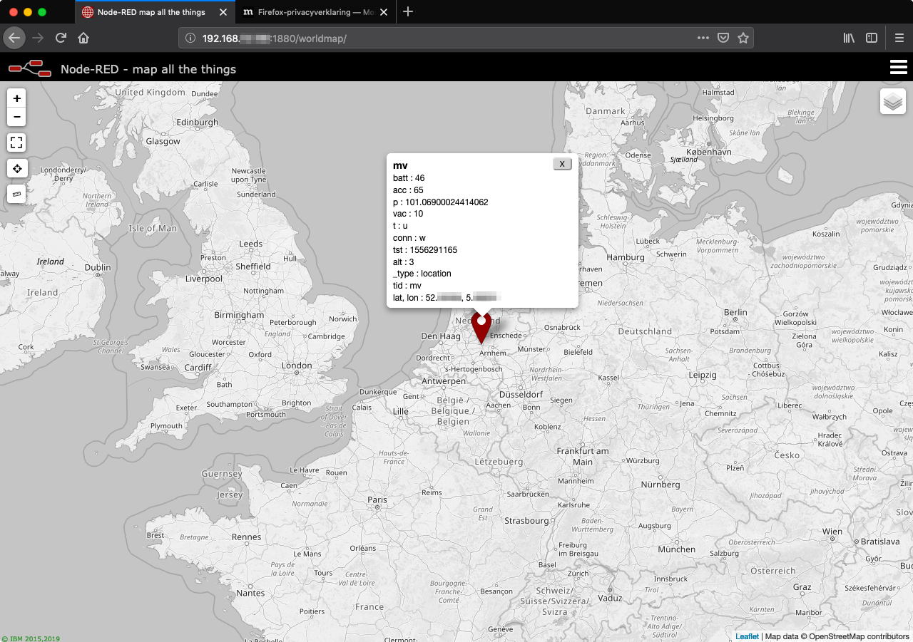
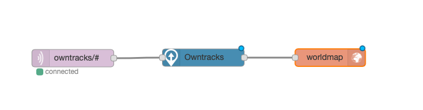

[Main document](README.md)
# Start the Demo

MQTT is sometimes refered to as 'push notifications'. This means that there is virtually no network traffic unless information has to be shared between a subscriber and a publisher.

The publisher pushes the information to the MQTT broker using topics. The MQTT broker forwards these message to those who have subscribed to these topics.

*Hence it is important that all participants use the same MQTT broker.*

It is possible to trace these messages using the command line.

You need to know the hostname or IP address of the MQTT broker that you are using.

Enter the following command in a terminal session to see the exchange of messages:

```bash
mosquitto_sub -v -h {hostname|ip address} -t "owntracks/#"
```

Just keep it running for a while. It could take some time before the first messages arrive.
 
If you are using the Raspberry Pi as the MQTT broker you can connect to the following URL: `http://{hostname|ip address}:1880/worldmap` with a webbrowser. Don't forget the portnumber (1880).

Find your area on the map, or zoom out, and wait for the location messages to arrive. They will show up nicely. It could (should) look similar to this:


If you want to change some settings in Node RED navigate to the following URL: `http://{hostname|ip address}:1880/`. There you'll see the flow that is used to display the locations on the world map. It looks like this: .

[Main document](README.md)
